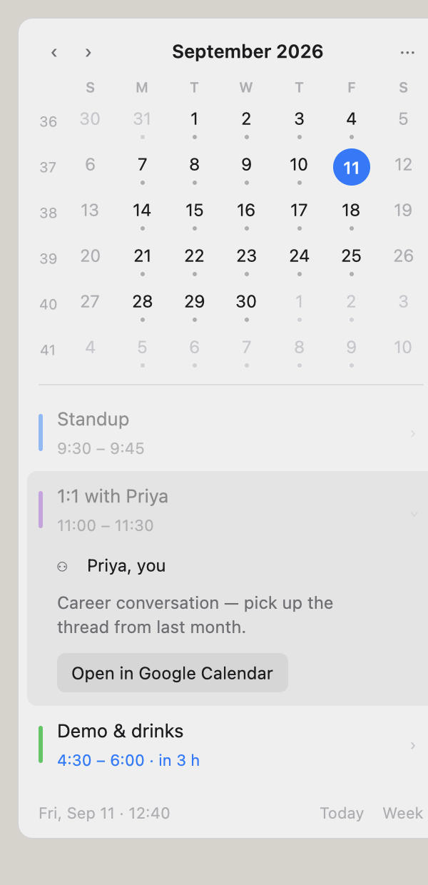

# daybar

A macOS menu bar calendar, written in Rust with [GPUI](https://www.gpui.rs/).

The menu bar shows a small calendar glyph and today's date. Click it and a popover drops down
with a month grid (Sunday-start, ISO week numbers, a dot on days that have something on them)
and the selected day's events, read straight from Calendar.app via EventKit — so whatever is
synced there, Google Calendar included, shows up. No Dock icon, no window management, and it
never opens another app unless you ask it to.



<!-- Screenshot placeholder: open the app, click the menu bar item, and save a capture of the
     popover to docs/screenshot.png. -->

## Build and run

Requires Rust stable and Xcode (GPUI needs the Metal toolchain:
`xcodebuild -downloadComponent MetalToolchain` if the build complains).

```sh
make run      # release build → target/Daybar.app → open it
make bundle   # just build the .app
make test     # cargo test
make check    # cargo fmt --check && cargo clippy --all-targets -D warnings
```

`make run` kills any running copy first. To see the UI without the menu bar, against fake data:

```sh
cargo run --example popover_preview
cargo run --example dump_events -- --stub   # print the next 7 days
```

## Calendar permission

On first launch macOS asks for full calendar access. The prompt only appears for the bundled
`Daybar.app` (it carries `NSCalendarsFullAccessUsageDescription`), which is why `make run`
builds a bundle rather than running the bare binary. Until access is granted the popover simply
shows no events; grant or revoke it later in **System Settings › Privacy & Security › Calendars**.

The app is ad-hoc signed, so a rebuild can occasionally reset that grant and re-prompt.

Events are cached 60 days back and 90 days ahead, refetched every 5 minutes and every time the
popover opens.

## Keys

| Key | |
| --- | --- |
| `←` `→` | previous / next day |
| `↑` `↓` | previous / next week |
| `t` | jump to today |
| `⏎` | open the selected day in Google Calendar |
| `esc` | close the popover |

`‹` `›` page the month grid without moving the selection. Clicking a day selects it and switches
back to Day mode; the Day/Week toggle swaps the list between one day and the Sun–Sat week around
the selection.

## Layout

- `src/main.rs` — activation policy, status item, popover window, refresh schedule
- `src/model.rs` — `Event`, the grid and date math, formatting helpers (pure, unit-tested)
- `src/calendar/` — `CalendarSource` trait, `eventkit.rs`, `store.rs` cache, `stub.rs` for dev
- `src/ui/` — `popover.rs` root view plus `month_grid`, `day_list`, `week_list`, `theme`
- `scripts/bundle.sh` — builds `Daybar.app`
